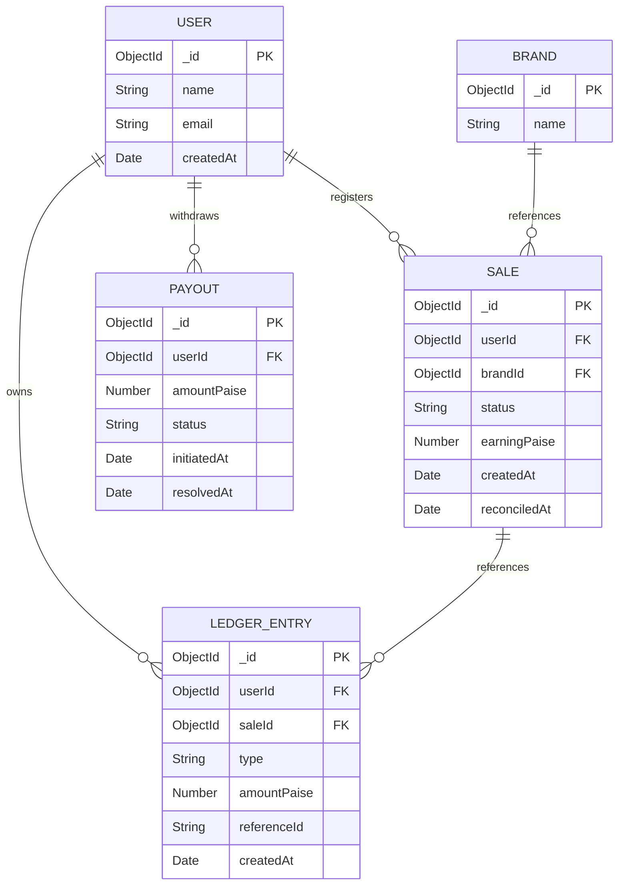

# Payout System Low-Level Design (LLD)

This document describes the Low-Level Design (LLD), DB schema, class architecture, indexing strategy, API contracts, and edge-case handling for the Payout System.

---

## 1. Database Schema Design (Mongoose)

All financial figures are stored as **integers in paise** (₹1 = 100 paise) to eliminate floating-point rounding issues. Conversion to Rupees (₹) is done only at the API response boundary.

### User Model (`users`)
Tracks the user's basic profile details. No balance or limits are cached here.
```javascript
{
  name: { type: String, required: true },
  email: { type: String, required: true, unique: true, index: true },
  createdAt: { type: Date, default: Date.now }
}
```

### Brand Model (`brands`)
Reference lookup collection for brands.
```javascript
{
  name: { type: String, required: true }
}
```

### Sale Model (`sales`)
Tracks affiliate sales which start in the `pending` status.
```javascript
{
  userId: { type: mongoose.Schema.Types.ObjectId, ref: 'User', required: true, index: true },
  brandId: { type: mongoose.Schema.Types.ObjectId, ref: 'Brand', required: true, index: true },
  status: { type: String, enum: ['pending', 'approved', 'rejected'], default: 'pending', index: true },
  earningPaise: { type: Number, required: true }, // total earnings in paise (must be > 0)
  reconciledAt: { type: Date, default: null },
  createdAt: { type: Date, default: Date.now }
}
```

### Ledger Entry Model (`ledger_entries`)
Immutable double-entry general ledger. Balance calculations are dynamically aggregated over this collection.
```javascript
{
  userId: { type: mongoose.Schema.Types.ObjectId, ref: 'User', required: true, index: true },
  saleId: { type: mongoose.Schema.Types.ObjectId, ref: 'Sale', default: null }, // associated sale if any
  type: { 
    type: String, 
    enum: ['ADVANCE', 'FINAL_SETTLEMENT', 'ADJUSTMENT', 'WITHDRAWAL', 'REVERSAL'], 
    required: true 
  },
  amountPaise: { type: Number, required: true }, // positive for credits, negative for debits (signed)
  referenceId: { type: String, default: null }, // e.g. references payout _id
  createdAt: { type: Date, default: Date.now }
}
```

### Payout Model (`payouts`)
Manages standard payout withdrawal requests (separate from ledger records).
```javascript
{
  userId: { type: mongoose.Schema.Types.ObjectId, ref: 'User', required: true, index: true },
  amountPaise: { type: Number, required: true }, // in paise
  status: { 
    type: String, 
    enum: ['initiated', 'completed', 'failed', 'cancelled'], 
    default: 'initiated' 
  },
  initiatedAt: { type: Date, default: Date.now },
  resolvedAt: { type: Date, default: null }
}
```

---

## 2. Entity-Relationship (ER) Diagram



---

## 3. Class / Module Design

We isolate concerns by mapping one file per logical service class:

| Class | Responsibility | Public Methods | Depends On |
|---|---|---|---|
| `SaleService` | Manages sale generation and database transaction-guaranteed approvals/rejections. | `recordSale(userId, brandId, earningPaise)`, `reconcileSale(saleId, status, finalEarningPaise)` | `User`, `Brand`, `Sale`, `LedgerEntry` |
| `AdvancePayoutJobService` | Safely executes batch 10% advance payout operations, catching unique constraint index violations. | `processPendingAdvances()` | `Sale`, `LedgerEntry` |
| `LedgerService` | Derives user balance dynamically using aggregation filters and fetches transaction histories. | `getWithdrawableBalance(userId)`, `getLedgerEntries(userId, limit, offset)` | `LedgerEntry` |
| `PayoutService` | Orchestrates withdrawal generation, checks limits, and executes failure reversals. | `requestPayout(userId, amountPaise)`, `failPayout(payoutId)` | `Payout`, `LedgerEntry`, `LedgerService`, `WithdrawalService` |
| `WithdrawalService` | Verifies withdrawal paces and checks when the user last initiated a withdrawal. | `getLastWithdrawalAt(userId)` | `LedgerEntry` |

---

## 4. Indexing Strategy

We enforce data safety, correctness, and speed via indexes:

| Collection | Index Schema | Unique / Partial | Reason |
|---|---|---|---|
| `ledgerEntries` | `{ saleId: 1, type: 1 }` | `Unique: true`, Partial: `{ type: 'ADVANCE' }` | **Idempotency Guarantee**: Ensures a sale can only ever receive a single advance payout. MongoDB rejects duplicate inserts at the database layer. |
| `ledgerEntries` | `{ userId: 1 }` | `Unique: false` | **Hot Read Path**: Optimizes dynamic balance calculations (`$match: { userId }` + `$sum`). |
| `ledgerEntries` | `{ userId: 1, createdAt: -1 }` | `Unique: false` | Optimizes retrieval of the user's paginated ledger history and quick fetching of the last withdrawal record. |
| `sales` | `{ status: 1 }` | `Unique: false` | Speeds up the background advance payout job query (finds `{ status: 'pending' }` rows). |
| `sales` | `{ userId: 1 }` | `Unique: false` | Optimizes dashboard reporting / aggregate query of user earnings. |
| `sales` | `{ brandId: 1 }` | `Unique: false` | Resolves reference lookups and brand-level reporting queries. |
| `payouts` | `{ userId: 1, status: 1 }` | `Unique: false` | Supports quick verification of active/failed payouts. |

---

## 5. Walkthrough of the ₹120-pending → ₹68-final Example

Here is the step-by-step trace of how the double-entry ledger database state evolves during this lifecycle:

### Step 1: Sale is Registered
An affiliate sale is created with total earnings of ₹120 (12,000 paise) in the `pending` status.
- **Sale Document created**:
  ```javascript
  {
    _id: ObjectId("6a5c7f3b86bf4900ba61f401"),
    userId: ObjectId("user_1001"),
    brandId: ObjectId("brand_2002"),
    status: "pending",
    earningPaise: 12000,
    createdAt: ISODate("2026-07-19T13:00:00Z")
  }
  ```
- **Ledger Entries**: None (no balance is withdrawable yet).
- **Derived Balance**: ₹0.00.

### Step 2: Background Advance Payout Job Runs
The job scans pending sales, calculates a 10% advance (₹12 / 1,200 paise), and records it in the ledger.
- **LedgerEntry inserted**:
  ```javascript
  {
    _id: ObjectId("ledger_abc001"),
    userId: ObjectId("user_1001"),
    saleId: ObjectId("6a5c7f3b86bf4900ba61f401"),
    type: "ADVANCE",
    amountPaise: 1200, // ₹12.00 CREDIT
    referenceId: null,
    createdAt: ISODate("2026-07-19T13:05:00Z")
  }
  ```
- **Derived Balance**: ₹12.00 (from `+1200` paise).

### Step 3: Admin Reconciles Sale to Approved with Final Earnings of ₹68 (6,800 paise)
The admin approves the sale with a modified final earnings amount of ₹68. 
- **Calculation**:
  - `advance_paid` = ₹12.00 (1,200 paise).
  - `remaining_due` = `final_earning - advance_paid` = `6800 - 1200 = 5600` paise (₹56.00).
- **Sale Document updated**:
  ```javascript
  {
    _id: ObjectId("6a5c7f3b86bf4900ba61f401"),
    status: "approved",
    reconciledAt: ISODate("2026-07-19T13:10:00Z")
  }
  ```
- **LedgerEntry inserted**:
  ```javascript
  {
    _id: ObjectId("ledger_abc002"),
    userId: ObjectId("user_1001"),
    saleId: ObjectId("6a5c7f3b86bf4900ba61f401"),
    type: "FINAL_SETTLEMENT",
    amountPaise: 5600, // ₹56.00 CREDIT
    referenceId: null,
    createdAt: ISODate("2026-07-19T13:10:00Z")
  }
  ```
- **Derived Balance**: ₹68.00 (Sum of ledger entries: `1200 + 5600 = 6800` paise).

---

## 6. API Contract

All endpoints return structured error bodies when failing: `{ error: { code: string, message: string } }`.

### 6.1 User & Brand APIs
*   **`POST /api/users`**
    - Creates a new user.
    - Request: `{ "name": "Kathan Shah", "email": "kathan@example.com" }`
    - Response: `201 Created`
      ```json
      { "id": "user_id", "name": "Kathan Shah", "email": "kathan@example.com", "balanceINR": 0.00 }
      ```
*   **`POST /api/brands`**
    - Creates a new brand.
    - Request: `{ "name": "BrandAcme" }`
    - Response: `201 Created`
      ```json
      { "id": "brand_id", "name": "BrandAcme" }
      ```

### 6.2 Transaction & Lifecycle APIs

*   **`POST /api/sales`**
    - Logs a sale in the `pending` state.
    - Request: `{ "userId": "user_id", "brandId": "brand_id", "earningPaise": 12000 }`
    - Response: `201 Created`
      ```json
      { "saleId": "sale_id", "status": "pending", "earningINR": 120.00 }
      ```

*   **`POST /api/jobs/advance-payout`**
    - Runs the background job to pay a 10% advance payout on all pending sales exactly once.
    - Response: `200 OK`
      ```json
      { "processedCount": 1, "totalAdvancePaidINR": 12.00 }
      ```

*   **`POST /api/sales/:id/reconcile`**
    - Admin reconciles a pending sale to approved or rejected. Optional `finalEarningPaise` parameter defaults to the sale's initial earning amount.
    - Request (Approved at ₹68): `{ "status": "approved", "finalEarningPaise": 6800 }`
    - Response (Approved): `200 OK`
      ```json
      { "saleId": "sale_id", "status": "approved", "remainingPaidINR": 56.00 }
      ```
    - Request (Rejected): `{ "status": "rejected" }`
    - Response (Rejected): `200 OK`
      ```json
      { "saleId": "sale_id", "status": "rejected", "adjustmentINR": -12.00 }
      ```

*   **`GET /api/users/:id/balance`**
    - Retrieves a user's dynamically derived withdrawable balance in Rupees (INR).
    - Response: `200 OK`
      ```json
      { "userId": "user_id", "balanceINR": 68.00 }
      ```

*   **`POST /api/users/:id/withdraw`**
    - Requests a withdrawal (payout). Initiates in `initiated` status. Enforces 24h throttle.
    - Request: `{ "amountPaise": 5000 }`
    - Response: `201 Created`
      ```json
      { "payoutId": "payout_id", "status": "initiated", "amountINR": 50.00 }
      ```

*   **`POST /api/payouts/:id/fail`**
    - Webhook simulating processor payout failure. Reverts the withdrawal with a positive compensation ledger entry (`REVERSAL`).
    - Response: `200 OK`
      ```json
      { "payoutId": "payout_id", "status": "failed", "refundedINR": 50.00 }
      ```

*   **`GET /api/users/:id/ledger`**
    - Retrieves a user's full transactions ledger history for debugging and auditing.
    - Response: `200 OK`
      ```json
      [
        {
          "id": "ledger_entry_id",
          "saleId": "sale_id",
          "type": "ADVANCE",
          "amountINR": 12.00,
          "referenceId": null,
          "createdAt": "2026-07-19T13:00:00Z"
        }
      ]
      ```

---

## 7. Edge-Case Handling Specifications

1. **Idempotent Job execution**:
   - Compounding index `{ saleId: 1, type: 1 }` with partial filter `{ type: 'ADVANCE' }` will block duplicate advance entries.
   - If the job attempts a duplicate insert, Mongoose catches the `11000` Duplicate Key Error and no-ops (returns `processedCount` unchanged without throwing a 500).
2. **Reconciliation State Lock**:
   - If `reconcileSale` is called on a sale that is already `'approved'` or `'rejected'`, the API rejects the request with HTTP **`409 Conflict`** and an error code `ALREADY_RECONCILED`.
3. **Reconciliation Without Advance**:
   - If a sale is reconciled to `'approved'` before the background advance job pays out the 10% advance (i.e. no `ADVANCE` ledger entry exists for the sale):
     - The service skips paying an advance and immediately pays the **full 100% earnings** as `FINAL_SETTLEMENT`.
     - The sale is marked `approved`.
     - No adjustments are written.
   - If the sale is reconciled to `'rejected'` before the background advance job pays out the 10% advance:
     - No advance has been paid out, so no clawback adjustment is necessary.
     - The sale is marked `rejected`.
4. **24-Hour Withdrawal Lockout**:
   - If a withdrawal is requested within 24 hours of the most recent `WITHDRAWAL` ledger document:
     - Rejects with HTTP **`429 Too Many Requests`**, code `WITHDRAWAL_LOCKED`, and provides details on `retryAfterSeconds` or retry time.
5. **Withdrawal Overdraft Protection**:
   - If the requested withdrawal amount exceeds the derived withdrawable balance:
     - Rejects with HTTP **`400 Bad Request`** and code `INSUFFICIENT_BALANCE`.
6. **Double-Failure Prevention**:
   - If a payout failure webhook is called for a payout that has already been resolved (i.e. status is not `'initiated'`), the API rejects the request with HTTP **`409 Conflict`** or **`400 Bad Request`** and code `PAYOUT_ALREADY_RESOLVED`, preventing double credits.
7. **Negative/Zero Earnings Input Check**:
   - When registering a sale (`POST /sales`), if the `earningPaise` is `<= 0`, the API rejects with HTTP **`400 Bad Request`** and code `INVALID_EARNINGS`.
